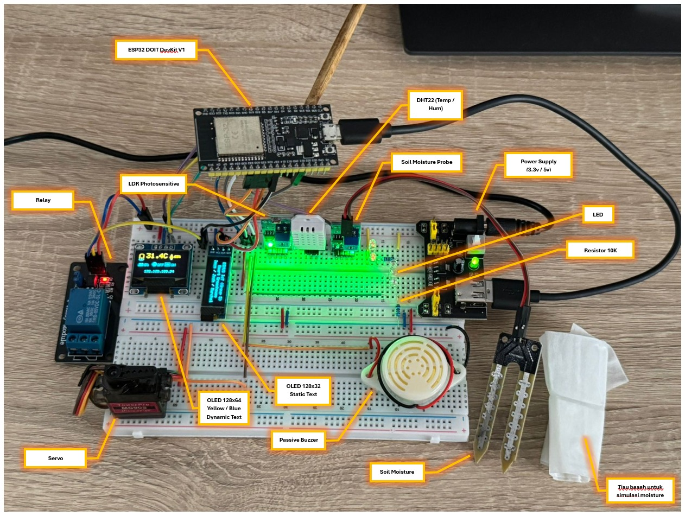
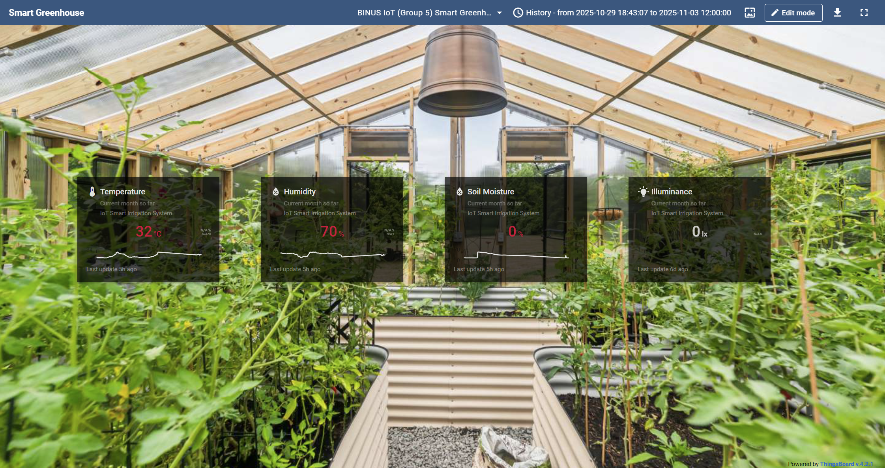
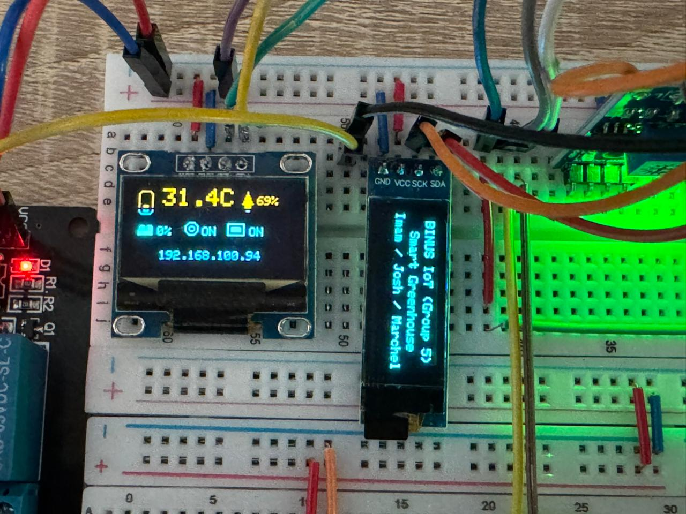

# IoT Smart Greenhouse 🌱🚰📊

> ESP32-based smart greenhouse: baca sensor (soil, suhu, kelembapan, cahaya), tampilkan di OLED, kontrol pompa + servo otomatis, alarm buzzer, dan kirim telemetry ke ThingsBoard.

[](https://platformio.org/)
[](https://www.espressif.com/en/products/socs/esp32)
[](#)
[](https://thingsboard.io/)






---

## 🚀 Fitur Utama

- 📡 **Telemetry realtime** ke ThingsBoard: soil moisture (% & raw), suhu, RH, status relay, dan alarm.
- 🖥️ **Dual OLED I²C** (128×32 & 128×64) untuk status cepat + ikon sederhana.
- 🤖 **Kontrol pompa otomatis** berbasis ambang basah/kering + **servo** untuk membuka/menutup kran.
- 🔔 **Buzzer pattern** otomatis jika pompa menyala melewati timeout.
- 🔌 **Relay active-LOW** dengan hysteresis (dry/wet threshold) agar tidak “chattering”.
- 🔁 **OTA update** & log ke ThingsBoard via MQTT.

---

## 🔧 Hardware & Pin Mapping

| Komponen | Pin | Keterangan |
|-----------|-----|-------------|
| OLED 128×32 | SDA=25, SCL=26 | Status singkat |
| OLED 128×64 | SDA=23, SCL=22 | Tampilan utama |
| Servo | 4 | Buka/tutup kran |
| LED indikator | 17 | Nyala saat gelap |
| Buzzer | 16 | Buzzer pasif (LEDC) |
| Soil Sensor | 32 | Analog input |
| LDR | 33 | Digital (INPUT_PULLUP) |
| Relay | 27 | Active-LOW |
| DHT22 | 13 | Sensor suhu & RH |

> Servo menggunakan LEDC 50 Hz (0° = tutup, 90° = buka).

---

## 🧠 Logika Kendali

- **Soil mapping**: `soilRaw` 1600 → 3800 menjadi **100% → 0%**.
- **Pompa otomatis**:
  - ON jika ≤ 20 % (tanah kering)
  - OFF jika ≥ 60 % (tanah basah)
  - Di antara dua nilai tersebut → tahan status terakhir.
- **Servo** mengikuti status pompa.
- **Buzzer** aktif beep pattern bila pompa ON > 1 menit.
- **LED** nyala saat `ldrBright == false`.

---

## 🛰️ Telemetry ke ThingsBoard

Kirim data via MQTT ke topic `v1/devices/me/telemetry`:

```json
{
  "soilPercent": 42,
  "soilRaw": 3100,
  "ldrBright": 1,
  "temperature": 31.6,
  "humidity": 60.5,
  "relayOn": 1,
  "soilAlarm": true,
  "tempAlarm": false
}
```

> Default host: demo.thingsboard.io, port 1883.

## 🗂️ Struktur Proyek

```
iot-smart-greenhouse/
├─ src/
│  └─ main.cpp
├─ include/
├─ lib/
├─ dashboard.json
├─ platformio.ini
└─ secrets.ini.dist
```

## ⚙️ Setup & Build (PlatformIO)

1. Clone Repository
    ```
    git clone https://github.com/imamdigmi/iot-smart-greenhouse.git
    cd iot-smart-greenhouse
    ```
2. Siapkan Secrets
    ```
    ARG_WIFI_SSID = "WIFI_NAME"
    ARG_WIFI_PASS = "WIFI_PASS"
    ARG_OTA_HOST = "esp32-greenhouse"
    ARG_OTA_PASS = "otapass"
    ARG_TB_ACCESS_TOKEN = "your-thingsboard-token"
    ```
3. Build & Upload via USB
    ```
    pio run -t upload
    pio device monitor
    ```
4. Upload OTA (opsional)

    ```
    pio run -t upload --upload-port esp32-greenhouse.local --auth otapass
    ```

## 📊 ThingsBoard Dashboard

1. Buat *Device* di ThingsBoard dan salin **Access Token**.
2. Masukkan ke `secrets.ini`.
3. Import `dashboard.json` di menu `Dashboards > Import`.
4. Kaitkan device dengan dashboard.

## 🖥️ Tampilan OLED

- OLED **128×64**: menampilkan ikon suhu, kelembapan, tanah, cahaya, dan relay.
- OLED **128×32**: menampilkan IP address & status singkat.

## 🧪 Uji Coba

- Cabut sensor soil → nilai raw naik → pompa ON.
- Celupkan kembali → soilPercent naik → pompa OFF.
- Biarkan pompa ON > 1 menit → buzzer beep.

## 🛣️ Roadmap

- [ ] TLS MQTT + CA bundle
- [ ] Kalibrasi soil dari dashboard
- [ ] Manual override (RPC)
- [ ] Logging events ke ThingsBoard attributes

## 🧾 Catatan Teknis

- MQTT topic: v1/devices/me/telemetry
- Relay: LOW = ON
- Servo pulse: 500-2500 µs
- Hysteresis: Dry ≤ 20 %, Wet ≥ 60 %

## 🙌 Kredit
- Kode dan dashboard oleh @imamdigmi
- Dibangun dengan PlatformIO, library Adafruit SSD1306, Adafruit GFX, DHT, PubSubClient, ArduinoOTA
